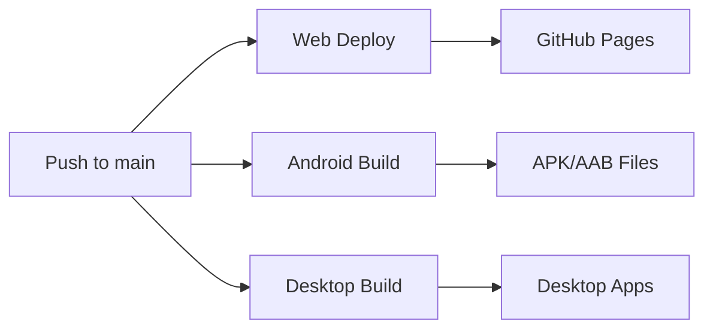

# 🚀 GlobGram Automatic Deployment Guide

## ✅ YES! Your App Will Deploy Automatically

When you **push to the `main` branch**, GitHub Actions automatically:

### 🌐 **Web App Deployment**
- ✅ Builds your web app with Vite
- ✅ Deploys to GitHub Pages 
- ✅ Available at: `https://tayden1990.github.io/GlobGram-alpha-v2.0.0/`
- ✅ Includes Digital Asset Links for TWA verification
- ✅ Updates PWA manifest and service worker

### 📱 **Android App Build** 
- ✅ Builds signed APK and AAB files
- ✅ Creates downloadable artifacts
- ✅ Verifies keystore fingerprint
- ✅ Ready for Google Play Store upload

### 🖥️ **Desktop Apps**
- ✅ Creates Windows, macOS, and Linux desktop apps
- ✅ Uses Nativefier to wrap your web app

## 🔄 **Deployment Workflow**



## 📋 **Current Setup Status**

| Component | Status | Notes |
|-----------|--------|-------|
| Web Deployment | ✅ Working | Auto-deploys to GitHub Pages |
| Android TWA | ✅ Ready | Fingerprint configured in assetlinks.json |
| Native Permissions | ✅ Added | Camera, microphone, notifications |
| Digital Asset Links | ✅ Set | Enables native app behavior |
| Desktop Apps | ✅ Working | Cross-platform builds |
| PWA Features | ✅ Enhanced | Offline support, notifications |

## 🛠️ **Required GitHub Secrets**

Make sure these secrets are set in your GitHub repository:

```
ANDROID_KEYSTORE_BASE64     # Base64 encoded keystore file
ANDROID_KEY_ALIAS          # Keystore alias (default: Tayden1990)
ANDROID_KEY_PASSWORD       # Key password  
ANDROID_STORE_PASSWORD     # Store password
```

## 🔍 **How to Verify Everything Works**

### 1. **Check Web Deployment**
Visit: `https://tayden1990.github.io/GlobGram-alpha-v2.0.0/`

### 2. **Verify Digital Asset Links**
Visit: `https://tayden1990.github.io/GlobGram-alpha-v2.0.0/.well-known/assetlinks.json`

### 3. **Test TWA Verification**
Use Google's tool: `https://digitalassetlinks.googleapis.com/v1/statements:list?source.web.site=https://tayden1990.github.io&relation=delegate_permission/common.handle_all_urls`

### 4. **Download Android APK**
- Go to GitHub Actions tab
- Find latest successful run
- Download the `android-apk` artifact

## 📱 **Installing Your Android App**

1. **Download APK** from GitHub Actions artifacts
2. **Enable "Install from Unknown Sources"** on your Android device
3. **Install the APK** - it should open as a native app
4. **No browser UI** should be visible (address bar, navigation buttons)
5. **Native permissions** should work (camera, microphone, notifications)

## 🔧 **Troubleshooting**

### App Opens in Chrome Instead of Native
1. ✅ Check Digital Asset Links are accessible
2. ✅ Verify fingerprint matches between keystore and assetlinks.json  
3. ✅ Clear Chrome app data and try again
4. ✅ Ensure website is HTTPS

### Build Failures
1. ✅ Check GitHub Secrets are set correctly
2. ✅ Verify keystore is valid and accessible
3. ✅ Check GitHub Actions logs for specific errors

### Permissions Not Working  
1. ✅ Verify AndroidManifest.xml has required permissions
2. ✅ Test on Android 6.0+ (runtime permissions required)
3. ✅ Check web app requests permissions properly

## 🎯 **Next Steps After Push**

1. **Push your changes** to the `main` branch
2. **Monitor GitHub Actions** for successful builds
3. **Test the deployed web app** at your GitHub Pages URL
4. **Download and test** the Android APK
5. **Verify native app behavior** (no browser UI, permissions work)

## 📊 **File Deployment Map**

Your repository structure ensures these files are properly deployed:

```
📁 Repository Root
├── 📄 public/.well-known/assetlinks.json  → Web deployment (TWA verification)
├── 📄 public/manifest.webmanifest         → Web deployment (PWA config)
├── 📄 public/sw.js                        → Web deployment (Service worker)
├── 📁 app/                                → Android build source
├── 📄 twa-manifest.json                   → Android TWA config
└── 📁 .github/workflows/                  → Automation scripts
```

## 🚀 **Ready to Deploy!**

Your setup is complete and ready for automatic deployment. Simply:

```bash
git add .
git commit -m "Ready for automatic deployment"
git push origin main
```

GitHub Actions will handle the rest! 🎉
